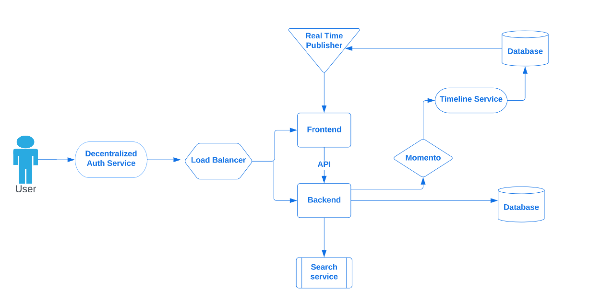
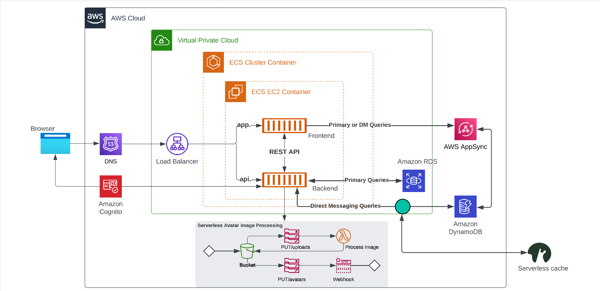
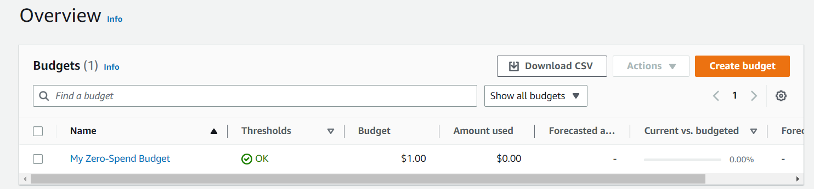

# Week 0 — Billing and Architecture

## Required Homework/tasks

Cruddur, a micro blogging platform which is build around the 6 pillars of the AWS Well-Architected tool- operational excellence, security, reliability, performance efficiency, cost optimization, and sustainability with the aim of providing a consistent approach to evaluate architecture and implement scalable designs.

### Cruddur Conceptual Diagram




[*Cruddur Conceptual Diagram*](https://lucid.app/lucidchart/4c3988c6-3997-48a8-8cdc-e2971695a1a0/edit?viewport_loc=127%2C42%2C1707%2C811%2C0_0&invitationId=inv_55ae69f6-ecac-42a1-9ab9-b19753afa5e6)


### Cruddur Logical Diagram



[*Cruddur Logical Diagram*](https://lucid.app/lucidchart/85186717-358f-47f1-a6e7-0bbd53e75782/edit?viewport_loc=71%2C79%2C1707%2C811%2C0_0&invitationId=inv_57254522-3f85-4ad5-9e19-fb975d38be67)

#### Description

### Installing AWS CLI on Gitpod environment

Gitpod runs on linux x64 so we will use the following commands to download and install AWS CLI on Gitpod

```

curl "https://awscli.amazonaws.com/awscli-exe-linux-x86_64.zip" -o "awscliv2.zip"
unzip awscliv2.zip
sudo ./aws/install

```
[*for more details*](https://docs.aws.amazon.com/cli/latest/userguide/getting-started-install.html)

### Updating the gitpod.yaml 

To always install the AWS CLI anytime Gitpod is launched, we run update the *gitpod.yaml* file with the following code:
```
tasks:
  - name: aws-cli
    env:
      AWS_CLI_AUTO_PROMPT: on-partial
    init: |
      cd /workspace
      curl "https://awscli.amazonaws.com/awscli-exe-linux-x86_64.zip" -o "awscliv2.zip"
      unzip awscliv2.zip
      sudo ./aws/install
      cd $THEIA_WORKSPACE_ROOT
vscode:
  extensions:
    - 42Crunch.vscode-openapi
```
### Creation of IAM user

Now, to create IAM user, you will use the following commands
```
export AWS_ACCESS_KEY_ID="QWERTYUIOPASDFGGHJJJKKJ"     # AWS ACCESS KEY ID 
export AWS_SECRET_ACCESS_KEY="XXXXXXXXXXXXXXXXXXXXXXXXXXXXXXXXXXX" #AWS SECRET KEY 
export AWS_DEFAULT_REGION="ca-central-1"           # AWS REGION 
```
To display the user created use the following command
```
$ aws sts get-caller-identity

```


### Creation of Budget

```
{
  "BudgetLimit": {
      "Amount": "1",
      "Unit": "USD"
  },
  "BudgetName": "My Zero-Spend Budget",
  "BudgetType": "COST",
  "CostFilters": {
      "TagKeyValue": [
          "user:Key$value1",
          "user:Key$value2"
      ]
  },
  "CostTypes": {
      "IncludeCredit": true,
      "IncludeDiscount": true,
      "IncludeOtherSubscription": true,
      "IncludeRecurring": true,
      "IncludeRefund": true,
      "IncludeSubscription": true,
      "IncludeSupport": true,
      "IncludeTax": true,
      "IncludeUpfront": true,
      "UseBlended": false
  },
  "TimePeriod": {
      "Start": 1477958399,
      "End": 3706473600
  },
  "TimeUnit": "MONTHLY"
}

```
### Creation of budget notification 

```
[
  {
      "Notification": {
          "ComparisonOperator": "GREATER_THAN",
          "NotificationType": "ACTUAL",
          "Threshold": 80,
          "ThresholdType": "PERCENTAGE"
      },
      "Subscribers": [
          {
              "Address": "***REMOVED***",
              "SubscriptionType": "rayisraelokudzeto@gmail.com"
          }
      ]
  }
]

```


### Creation of Billing alarm

```
{
  "AlarmName": "DailyEstimatedCharges",
  "AlarmDescription": "This alarm would be triggered if the daily estimated charges exceeds 1$",
  "ActionsEnabled": true,
  "AlarmActions": [
      "arn:aws:sns:ca-central-1:***REMOVED***:billing-alarm"
  ],
  "EvaluationPeriods": 1,
  "DatapointsToAlarm": 1,
  "Threshold": 1,
  "ComparisonOperator": "GreaterThanOrEqualToThreshold",
  "TreatMissingData": "breaching",
  "Metrics": [{
      "Id": "m1",
      "MetricStat": {
          "Metric": {
              "Namespace": "AWS/Billing",
              "MetricName": "EstimatedCharges",
              "Dimensions": [{
                  "Name": "Currency",
                  "Value": "USD"
              }]
          },
          "Period": 86400,
          "Stat": "Maximum"
      },
      "ReturnData": false
  },
  {
      "Id": "e1",
      "Expression": "IF(RATE(m1)>0,RATE(m1)*86400,0)",
      "Label": "DailyEstimatedCharges",
      "ReturnData": true
  }]
}
```


