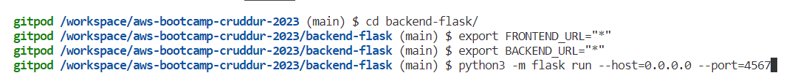

# Week 1 — App Containerization

## Building a Backend container

### create the environment variables & configure the host and port

```
cd backend-flask
export FRONTEND_URL="*"
export BACKEND_URL="*"
python3 -m flask run --host=0.0.0.0 --port=4567
cd ..
```



*Get to the port and unlock port 4567 and click the link and the append /api/activities/home to the url in the browser*

### Create a dockerfile for the backend 
Create a Dockerfile in the backend-flask folder

```
FROM python:3.10-slim-buster

WORKDIR /backend-flask

COPY requirements.txt requirements.txt
RUN pip3 install -r requirements.txt

COPY . .

ENV FLASK_ENV=development

EXPOSE ${PORT}
CMD [ "python3", "-m" , "flask", "run", "--host=0.0.0.0", "--port=4567"]

```

### Build the backend container
```
docker build -t  backend-flask ./backend-flask
```

### 
