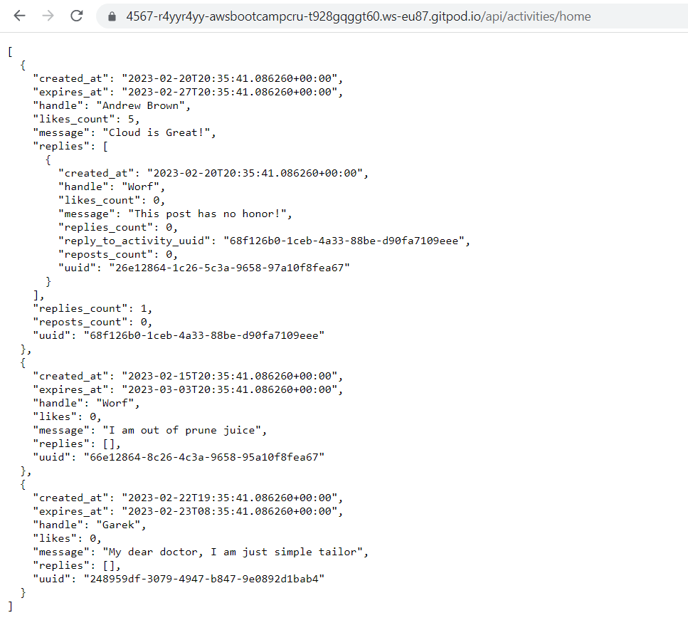
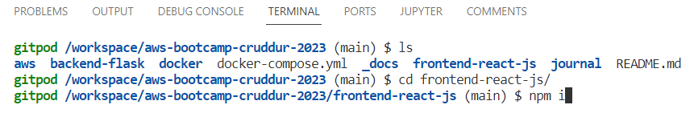
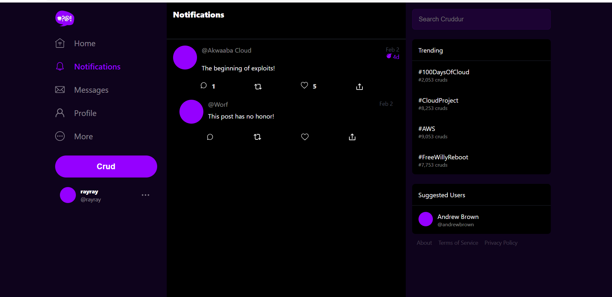
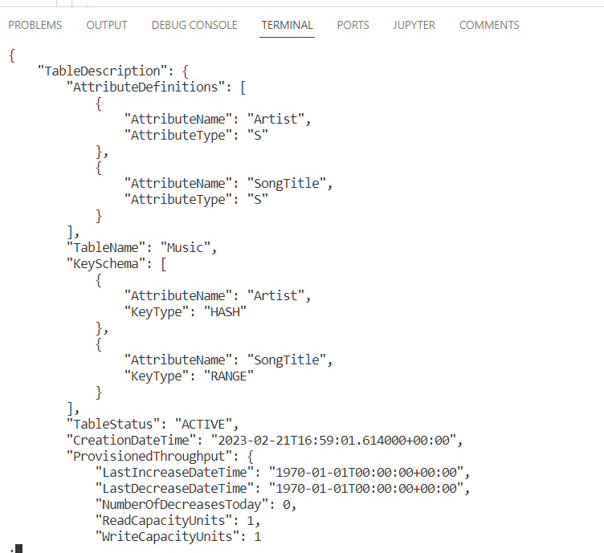
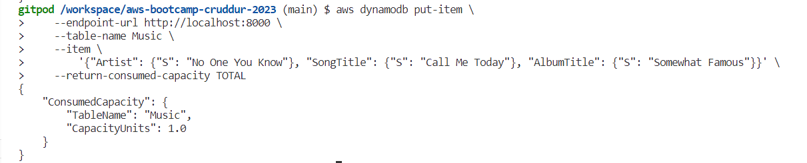
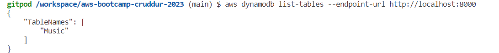
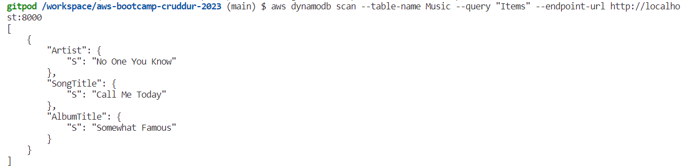
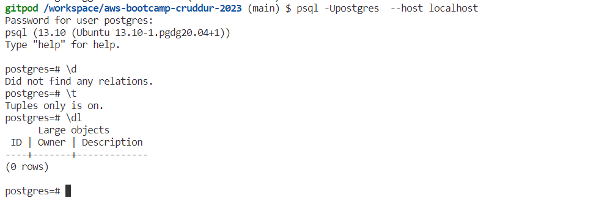

# Week 1 — App Containerization

## Building the Backend container with python

### creation of environment variables & configure the host and port 

```
cd backend-flask
run pip3 install -r requirements.txt
export FRONTEND_URL="*"
export BACKEND_URL="*"
python3 -m flask run --host=0.0.0.0 --port=4567
cd ..
```


*Access the port tab, unlock port 4567 and click the link and the append /api/activities/home to the url in the browser*



## Building the Backend docker container

### Creation of dockerfile for the backend 
Create a Dockerfile in the backend-flask folder

```
FROM python:3.10-slim-buster

WORKDIR /backend-flask

COPY requirements.txt requirements.txt
RUN pip3 install -r requirements.txt

COPY . .

ENV FLASK_ENV=development

EXPOSE ${PORT}
CMD [ "python3", "-m" , "flask", "run", "--host=0.0.0.0", "--port=4567"]

```

### Build the backend container
First, Lets unset the environment variables 
```
unset FRONTEND
unset BACKEND
```
We can verify the existence of the variables with the grep command
``` 
env | grep FRONTEND_URL
env | grep BACKEND_URL
````
Now return to the home directory and run the command below
```
docker build -t  backend-flask ./backend-flask
```

### Run backend docker container
```
docker run --rm -p 4567:4567 -it -e FRONTEND_URL='*' -e BACKEND_URL='*' backend-flask
```
*Get to the port and unlock port 4567 and click the link and the append /api/activities/home to the url in the browser*

## Building the Frontend docker container

### Create a dockerfile for the Frontend
Change directory to frontend-js and install npm since the container needs to copy the contents of node_modules



Create a Dockerfile in the frontend-react-js folder

```
FROM node:16.18

ENV PORT=3000

COPY . /frontend-react-js
WORKDIR /frontend-react-js
RUN npm install
EXPOSE ${PORT}
CMD ["npm", "start"]
```

### Build the frontend container
```
docker build -t frontend-react-js ./frontend-react-js
```


### Run frontend docker container
```
docker run -p 3000:3000 -d frontend-react-js
```
## Orchestrating multiple containers

Docker Compose is used to create manage and cleanup multi-container applications by reading and applying rules defined in a docker compose file.

Create the docker compose file under the home directory

```
version: "3.8"
services:
  backend-flask:
    environment:
      FRONTEND_URL: "https://3000-${GITPOD_WORKSPACE_ID}.${GITPOD_WORKSPACE_CLUSTER_HOST}"
      BACKEND_URL: "https://4567-${GITPOD_WORKSPACE_ID}.${GITPOD_WORKSPACE_CLUSTER_HOST}"
    build: ./backend-flask
    ports:
      - "4567:4567"
    volumes:
      - ./backend-flask:/backend-flask
  frontend-react-js:
    environment:
      REACT_APP_BACKEND_URL: "https://4567-${GITPOD_WORKSPACE_ID}.${GITPOD_WORKSPACE_CLUSTER_HOST}"
    build: ./frontend-react-js
    ports:
      - "3000:3000"
    volumes:
      - ./frontend-react-js:/frontend-react-js

# the name flag is a hack to change the default prepend folder
# name when outputting the image names
networks: 
  internal-network:
    driver: bridge
    name: cruddur
```

To run the docker compose file right click on the docker compose file and select compose up.

## Creation of the Notification feature

Run the docker compose file
NB: run " npm i " when the frontend port 3000 is not up

Let's add an endpoint for the notifications tab, locate the openapi.yml file and replace with the following code 

```
openapi: '3.0.2'
info:
  title: Cruddur Backend API
  version: '1.0'
    
servers:
  - url: https://api.server.test/v1
paths:
  /api/activities/home:
    get:
      description: 'Return a feed of activity based on all users'
      tags:
        - activities
      responses:
        '200':
          description: Returns an array of activities"
          content:
            application/json:
              schema:
                type: array
                items:
                  $ref: '#/components/schemas/Activity'
  /api/activities/search:
    get:
      description: 'Return a feed of activity based on a search term'
      tags:
        - activities
      parameters:
        - name: term
          in: query
          description: Search term used for full text search
          required: true
          schema:
            type: string
            example: "#100DaysOfCloud"
      responses:
        '200':
          description: Returns an array of activities"
          content:
            application/json:
              schema:
                type: array
                items:
                  $ref: '#/components/schemas/Activity'
  /api/activities:
    post:
      description: Create a new activitiy eg. Creating a Crud
      tags:
        - activities
      requestBody:
        required: true
        content:
          application/json:
            schema:
              type: object
              properties:
                handle:
                  type: string
                message:
                  type: string
                ttl:
                  type: string
      responses:
        '200':
          description: Returns a recently created activity"
          content:
            application/json:
              schema:
                type: object
                items:
                  $ref: '#/components/schemas/Activity'
  /api/activities/@{handle}:
    get:
      description: 'Return a feed of activity for a specific user'
      tags:
        - activities
      parameters:
        - name: handle
          in: path
          description: Handle (aka Username)
          required: true
          schema:
            type: string
      responses:
        '200':
          description: Returns an array of activities"
          content:
            application/json:
              schema:
                type: array
                items:
                  $ref: '#/components/schemas/Activity'
  /api/message_groups:
    get:
      description: 'Return a list of two way private conversations for the user'
      tags:
        - messages
      responses:
        '200':
          description: Returns an array of messages groups for a specific user
          content:
            application/json:
              schema:
                type: array
                items:
                  $ref: '#/components/schemas/MessageGroup'
  /api/messages/@{handle}:
    get:
      description: 'Returns private communication between two users'
      tags:
        - messages
      parameters:
        - name: handle
          in: path
          description: Handle (aka Username)
          required: true
          schema:
            type: string
      responses:
        '200':
          description: Returns an array of messages between two users
          content:
            application/json:
              schema:
                type: object
                items:
                  $ref: '#/components/schemas/Message'
  /api/messages:
    post:
      description: 'Create a direct message between two users'
      tags:
        - messages
      requestBody:
        required: true
        content:
          application/json:
            schema:
              type: object
              properties:
                user_receiver_handle:
                  type: string
      responses:
        '200':
          description: Return a single message
          content:
            application/json:
              schema:
                type: array
                items:
                  $ref: '#/components/schemas/Message'
  /api/activities/notifications:
    get:
      description: 'Return a feed of activity of all those that I follow'
      tags: 
         - activities
      parameters: []
      responses:
        '200':
          description: Returns array of activities
          content:
            application/json:
              schema:
                type: array
                items:
                  $ref: '#/components/schemas/Activity'

components:
  schemas:
    Activity:
      type: object
      properties:
        uuid:
          type: string
          example: 0056a369-4618-43a4-ad88-e7c371bf5582
        display_name:
          type: string
          example: "Andrew Brown"
        handle:
          type: string
          example: "andrewbrown"
        message:
          type: string
          example: "Who likes pineapple on their pizza?"
        replies_count:
          type: integer
          example: 5
        reposts_count:
          type: integer
          example: 2
        likes_count:
          type: integer
          example: 103
        created_at:
          type: string
          example: "2023-02-06T18:11:03+00:00"
        expires_at:
          type: string
          example: "2023-02-06T18:11:03+00:00"
    Reply:
      type: object
      properties:
        uuid:
          type: string
          example: 0056a369-4618-43a4-ad88-e7c371bf5582
        reply_to_activity_uuid:
          type: string
          example: 0056a369-4618-43a4-ad88-e7c371bf5582
        handle:
          type: string
          example: "andrewbrown"
        message:
          type: string
          example: "Who likes pineapple on their pizza?"
        replies_count:
          type: integer
          example: 5
        reposts_count:
          type: integer
          example: 2
        likes_count:
          type: integer
          example: 103
        created_at:
          type: string
          example: "2023-02-06T18:11:03+00:00"

    Message:
      type: object
      properties:
        uuid:
          type: string
          example: 0056a369-4618-43a4-ad88-e7c371bf5582
        display_name:
          type: string
          example: "Andrew Brown"
        handle:
          type: string
          example: "andrewbrown"
        message:
          type: string
          example: "Who likes pineapple on their pizza?"
        created_at:
          type: string
          example: "2023-02-06T18:11:03+00:00"
    MessageGroup:
      type: object
      properties:
        uuid:
          type: string
          example: 0056a369-4618-43a4-ad88-e7c371bf5582
        display_name:
          type: string
          example: "Worf"
        handle:
          type: string
          example: "worf"
          
 ```
 
### Create a notifications_activities.py and notifications_activities.css file in the in backend/services folder
 notifications_activities.py
 ```
 from datetime import datetime, timedelta, timezone
class NotificationsActivities:
  def run():
    now = datetime.now(timezone.utc).astimezone()
    results = [{
      'uuid': '68f126b0-1ceb-4a33-88be-d90fa7109eee',
      'handle':  'Akwaaba Cloud',
      'message': 'The beginning of exploits!',
      'created_at': (now - timedelta(days=2)).isoformat(),
      'expires_at': (now + timedelta(days=5)).isoformat(),
      'likes_count': 5,
      'replies_count': 1,
      'reposts_count': 0,
      'replies': [{
        'uuid': '26e12864-1c26-5c3a-9658-97a10f8fea67',
        'reply_to_activity_uuid': '68f126b0-1ceb-4a33-88be-d90fa7109eee',
        'handle':  'Worf',
        'message': 'This post has no honor!',
        'likes_count': 0,
        'replies_count': 0,
        'reposts_count': 0,
        'created_at': (now - timedelta(days=2)).isoformat()
      }],
    }
    ]
    return results
```
* You can modify the following lines below in the notifications_activities.py *
 'handle':  'Akwaaba Cloud',
 'message': 'The beginning of exploits!',
 
 Locate the App.js in the frontend-react-js/src folder and replace with the code below
 
 ```
 import './App.css';

import HomeFeedPage from './pages/HomeFeedPage';
import NotificationsFeedPage from './pages/NotificationsFeedPage';
import UserFeedPage from './pages/UserFeedPage';
import SignupPage from './pages/SignupPage';
import SigninPage from './pages/SigninPage';
import RecoverPage from './pages/RecoverPage';
import MessageGroupsPage from './pages/MessageGroupsPage';
import MessageGroupPage from './pages/MessageGroupPage';
import ConfirmationPage from './pages/ConfirmationPage';
import React from 'react';

import {
  createBrowserRouter,
  RouterProvider
} from "react-router-dom";

const router = createBrowserRouter([
  {
    path: "/",
    element: <HomeFeedPage />
  },
  {
    path: "/notifications",
    element: <NotificationsFeedPage />
  },
  {
    path: "/@:handle",
    element: <UserFeedPage />
  },
  {
    path: "/messages",
    element: <MessageGroupsPage />
  },
  {
    path: "/messages/@:handle",
    element: <MessageGroupPage />
  },
  {
    path: "/signup",
    element: <SignupPage />
  },
  {
    path: "/signin",
    element: <SigninPage />
  },
  {
    path: "/confirm",
    element: <ConfirmationPage />
  },
  {
    path: "/forgot",
    element: <RecoverPage />
  }
]);

function App() {
  return (
    <>
      <RouterProvider router={router} />
    </>
  );
}

export default App;

```
### Create the Notifications feed page in the frontend-react-js/src/pages folder named as NotificationsFeedPage.js 
```
import './NotificationsFeedPage.css';
import React from "react";

import DesktopNavigation  from '../components/DesktopNavigation';
import DesktopSidebar     from '../components/DesktopSidebar';
import ActivityFeed from '../components/ActivityFeed';
import ActivityForm from '../components/ActivityForm';
import ReplyForm from '../components/ReplyForm';

// [TODO] Authenication
import Cookies from 'js-cookie'

export default function HomeFeedPage() {
  const [activities, setActivities] = React.useState([]);
  const [popped, setPopped] = React.useState(false);
  const [poppedReply, setPoppedReply] = React.useState(false);
  const [replyActivity, setReplyActivity] = React.useState({});
  const [user, setUser] = React.useState(null);
  const dataFetchedRef = React.useRef(false);

  const loadData = async () => {
    try {
      const backend_url = `${process.env.REACT_APP_BACKEND_URL}/api/activities/notifications`
      const res = await fetch(backend_url, {
        method: "GET"
      });
      let resJson = await res.json();
      if (res.status === 200) {
        setActivities(resJson)
      } else {
        console.log(res)
      }
    } catch (err) {
      console.log(err);
    }
  };

  const checkAuth = async () => {
    console.log('checkAuth')
    // [TODO] Authenication
    if (Cookies.get('user.logged_in')) {
      setUser({
        display_name: Cookies.get('user.name'),
        handle: Cookies.get('user.username')
      })
    }
  };

  React.useEffect(()=>{
    //prevents double call
    if (dataFetchedRef.current) return;
    dataFetchedRef.current = true;

    loadData();
    checkAuth();
  }, [])

  return (
    <article>
      <DesktopNavigation user={user} active={'notifications'} setPopped={setPopped} />
      <div className='content'>
        <ActivityForm  
          popped={popped}
          setPopped={setPopped} 
          setActivities={setActivities} 
        />
        <ReplyForm 
          activity={replyActivity} 
          popped={poppedReply} 
          setPopped={setPoppedReply} 
          setActivities={setActivities} 
          activities={activities} 
        />
        <ActivityFeed 
          title="Notifications" 
          setReplyActivity={setReplyActivity} 
          setPopped={setPoppedReply} 
          activities={activities} 
        />
      </div>
      <DesktopSidebar user={user} />
    </article>
  );
}
```
### Create the Notifications feed page css file in the frontend-react-js/src/pages folder named as NotificationsFeedPage.css

```
article {
    display: flex;
    flex-direction: row;
    justify-content: center;
  }
  
```



## Creation of dynamodb local and postgresql

### Copy and paste the code below in the docker-compose file

```
  dynamodb-local:
    command: "-jar DynamoDBLocal.jar -sharedDb -dbPath ./data"
    image: "amazon/dynamodb-local:latest"
    container_name: dynamodb-local
    ports:
      - "8000:8000"
    volumes:
      - "./docker/dynamodb:/home/dynamodblocal/data"
    working_dir: /home/dynamodblocal
```


### Copy the paste the postgresql code in the docker-compose file

```
db:
    image: postgres:13-alpine
    restart: always
    environment:
      - POSTGRES_USER=postgres
      - POSTGRES_PASSWORD=password
    ports:
      - '5432:5432'
    volumes: 
      - db:/var/lib/postgresql/data
```

add the volume

```
volumes:
  db:
    driver: local
```
### Final docker-compose.yml file

```
version: "3.8"
services:
  backend-flask:
    environment:
      FRONTEND_URL: "https://3000-${GITPOD_WORKSPACE_ID}.${GITPOD_WORKSPACE_CLUSTER_HOST}"
      BACKEND_URL: "https://4567-${GITPOD_WORKSPACE_ID}.${GITPOD_WORKSPACE_CLUSTER_HOST}"
    build: ./backend-flask
    ports:
      - "4567:4567"
    volumes:
      - ./backend-flask:/backend-flask
  frontend-react-js:
    environment:
      REACT_APP_BACKEND_URL: "https://4567-${GITPOD_WORKSPACE_ID}.${GITPOD_WORKSPACE_CLUSTER_HOST}"
    build: ./frontend-react-js
    ports:
      - "3000:3000"
    volumes:
      - ./frontend-react-js:/frontend-react-js
  dynamodb-local:
    # https://stackoverflow.com/questions/67533058/persist-local-dynamodb-data-in-volumes-lack-permission-unable-to-open-databa
    # We needed to add user:root to get this working.
    user: root
    command: "-jar DynamoDBLocal.jar -sharedDb -dbPath ./data"
    image: "amazon/dynamodb-local:latest"
    container_name: dynamodb-local
    ports:
      - "8000:8000"
    volumes:
      - "./docker/dynamodb:/home/dynamodblocal/data"
    working_dir: /home/dynamodblocal
  db:
    image: postgres:13-alpine
    restart: always
    environment:
      - POSTGRES_USER=postgres
      - POSTGRES_PASSWORD=password
    ports:
      - '5432:5432'
    volumes: 
      - db:/var/lib/postgresql/data
# the name flag is a hack to change the default prepend folder
# name when outputting the image names
networks: 
  internal-network:
    driver: bridge
    name: cruddur
volumes:
  db:
    driver: local
```
### create a table in dynamodb

```
aws dynamodb create-table \
    --endpoint-url http://localhost:8000 \
    --table-name Music \
    --attribute-definitions \
        AttributeName=Artist,AttributeType=S \
        AttributeName=SongTitle,AttributeType=S \
    --key-schema AttributeName=Artist,KeyType=HASH AttributeName=SongTitle,KeyType=RANGE \
    --provisioned-throughput ReadCapacityUnits=1,WriteCapacityUnits=1 \
    --table-class STANDARD
```


### create an item in dynamodb

```
aws dynamodb put-item \
    --endpoint-url http://localhost:8000 \
    --table-name Music \
    --item \
        '{"Artist": {"S": "No One You Know"}, "SongTitle": {"S": "Call Me Today"}, "AlbumTitle": {"S": "Somewhat Famous"}}' \
    --return-consumed-capacity TOTAL  
```


### List tables in dynamodb

```
aws dynamodb list-tables --endpoint-url http://localhost:8000
```


### Get records in dynamodb

```
aws dynamodb scan --table-name Music --query "Items" --endpoint-url http://localhost:8000
```


### Postgresql
Username: postgres
Password: password
```
psql -Upostgres --host localhost
```


#### References
[*amazon dynamodb local*](https://docs.aws.amazon.com/amazondynamodb/latest/developerguide/DynamoDBLocal.html)

[*amazon dynamodb Tools*](https://docs.aws.amazon.com/amazondynamodb/latest/developerguide/Tools.CLI.html)


## Security Considerations

### Top 10 Container best practices for zero day

Container Security is the practice of protecting your applications hosted on compute services like Containers. exapmles of container applications are Single page applications, microservices, APIs, etc.

### Container Security Components

* Docker & Host configuration
* Securing Images
* Secret management
* Application security
* Data Security
* Monitoring Containers
* Compliance Framework

### Security Best Practices

* Keep Host & Docker Updated to latest security patches 
* Docker daemon & containers should run in non-root user mode 
* Image Vulnerability Scanning
* Trusting a private vs public image registry
* No sensitive Data in Docker files or images 
* Use secret Management services to share secrets
* Read only File system and volume for Docker 
* Seperate databases for long term storage 
* Use DevSecOps practices while building applications security
* Ensure all code is tested for vulnerabilities before production use

### Container Security tools

* Snyk
* AWS Secret Manager
* Amazon Inspector

