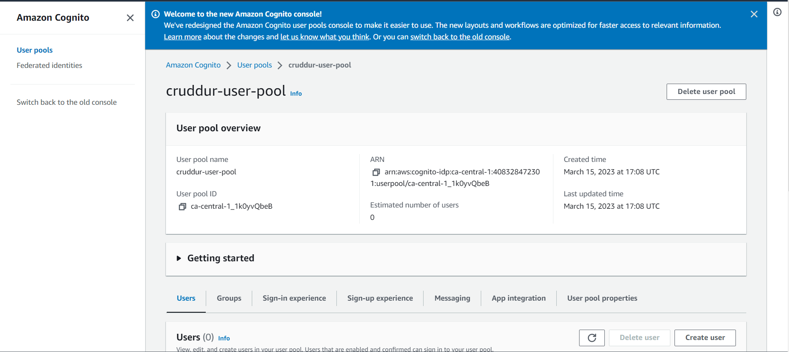
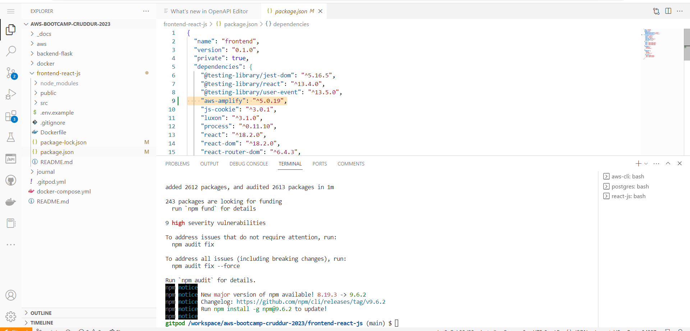

# Week 3 — Decentralized Authentication

## Setting up and integrating Cognito User pool into frontend

### Creation of User ID pool



### Install AWS Amplify Library

Change directory to frontend-react-js

```
npm i aws-amplify --save
```

Verify the installation in the package.js file



import amplify into App.js 

```
import { Amplify } from 'aws-amplify';
```

Configure Amplify 

```
import { Amplify } from 'aws-amplify';

Amplify.configure({
  "AWS_PROJECT_REGION": process.env.REACT_APP_AWS_PROJECT_REGION,
  "aws_cognito_identity_pool_id": process.env.REACT_APP_AWS_COGNITO_IDENTITY_POOL_ID,
  "aws_cognito_region": process.env.REACT_APP_AWS_COGNITO_REGION,
  "aws_user_pools_id": process.env.REACT_APP_AWS_USER_POOLS_ID,
  "aws_user_pools_web_client_id": process.env.REACT_APP_CLIENT_ID,
  "oauth": {},
  Auth: {
    // We are not using an Identity Pool
    // identityPoolId: process.env.REACT_APP_IDENTITY_POOL_ID, // REQUIRED - Amazon Cognito Identity Pool ID
    region: process.env.REACT_AWS_PROJECT_REGION,           // REQUIRED - Amazon Cognito Region
    userPoolId: process.env.REACT_APP_AWS_USER_POOLS_ID,         // OPTIONAL - Amazon Cognito User Pool ID
    userPoolWebClientId: process.env.REACT_APP_AWS_USER_POOLS_WEB_CLIENT_ID,   // OPTIONAL - Amazon Cognito Web Client ID (26-char alphanumeric string)
  }
});

```

#### Final code for App.js

```
import './App.css';

import HomeFeedPage from './pages/HomeFeedPage';
import NotificationsFeedPage from './pages/NotificationsFeedPage';
import UserFeedPage from './pages/UserFeedPage';
import SignupPage from './pages/SignupPage';
import SigninPage from './pages/SigninPage';
import RecoverPage from './pages/RecoverPage';
import MessageGroupsPage from './pages/MessageGroupsPage';
import MessageGroupPage from './pages/MessageGroupPage';
import ConfirmationPage from './pages/ConfirmationPage';
import React from 'react';

import {
  createBrowserRouter,
  RouterProvider
} from "react-router-dom";

import { Amplify } from 'aws-amplify';

Amplify.configure({
  "AWS_PROJECT_REGION": process.env.REACT_APP_AWS_PROJECT_REGION,
  "aws_cognito_region": process.env.REACT_APP_AWS_COGNITO_REGION,
  "aws_user_pools_id": process.env.REACT_APP_AWS_USER_POOLS_ID,
  "aws_user_pools_web_client_id": process.env.REACT_APP_CLIENT_ID,
  "oauth": {},
  Auth: {
    // We are not using an Identity Pool
    // identityPoolId: process.env.REACT_APP_IDENTITY_POOL_ID, // REQUIRED - Amazon Cognito Identity Pool ID
    region: process.env.REACT_APP_AWS_PROJECT_REGION,           // REQUIRED - Amazon Cognito Region
    userPoolId: process.env.REACT_APP_AWS_USER_POOLS_ID,         // OPTIONAL - Amazon Cognito User Pool ID
    userPoolWebClientId: process.env.REACT_APP_CLIENT_ID,   // OPTIONAL - Amazon Cognito Web Client ID (26-char alphanumeric string)
  }
});

const router = createBrowserRouter([
  {
    path: "/",
    element: <HomeFeedPage />
  },
  {
    path: "/notifications",
    element: <NotificationsFeedPage />
  },
  {
    path: "/@:handle",
    element: <UserFeedPage />
  },
  {
    path: "/messages",
    element: <MessageGroupsPage />
  },
  {
    path: "/messages/@:handle",
    element: <MessageGroupPage />
  },
  {
    path: "/signup",
    element: <SignupPage />
  },
  {
    path: "/signin",
    element: <SigninPage />
  },
  {
    path: "/confirm",
    element: <ConfirmationPage />
  },
  {
    path: "/forgot",
    element: <RecoverPage />
  }
]);

function App() {
  return (
    <>
      <RouterProvider router={router} />
    </>
  );
}

export default App;

```

Add the code below in the docker compose file

```
REACT_APP_AWS_PROJECT_REGION:"${AWS_DEFAULT_REGION}"
REACT_APP_AWS_COGNITO_REGION:"${AWS_DEFAULT_REGION}"
REACT_APP_AWS_USER_POOLS_ID:""
REACT_APP_AWS_CLIENT_ID:""
```

#### Final code for  docker compose file

```
version: "3.8"
services:
  backend-flask:
    environment:
      FRONTEND_URL: "https://3000-${GITPOD_WORKSPACE_ID}.${GITPOD_WORKSPACE_CLUSTER_HOST}"
      BACKEND_URL: "https://4567-${GITPOD_WORKSPACE_ID}.${GITPOD_WORKSPACE_CLUSTER_HOST}"
      #OTEL_SERVICE_NAME: "backend-flask"
      #OTEL_EXPORTER_OTLP_ENDPOINT: "https://api.honeycomb.io"
      #OTEL_EXPORTER_OTLP_HEADERS: "x-honeycomb-team=${HONEYCOMB_API_KEY}"
    build: ./backend-flask
    ports:
      - "4567:4567"
    volumes:
      - ./backend-flask:/backend-flask
  frontend-react-js:
    environment:
      REACT_APP_BACKEND_URL: "https://4567-${GITPOD_WORKSPACE_ID}.${GITPOD_WORKSPACE_CLUSTER_HOST}"
      REACT_APP_AWS_PROJECT_REGION: "${AWS_DEFAULT_REGION}"
      REACT_APP_AWS_COGNITO_REGION: "${AWS_DEFAULT_REGION}"
      REACT_APP_AWS_USER_POOLS_ID: "ca-central-1_I1ED76O28"
      REACT_APP_CLIENT_ID: "39b74nbmj0duhqsm28vn6c9fsi"
    build: ./frontend-react-js
    ports:
      - "3000:3000"
    volumes:
      - ./frontend-react-js:/frontend-react-js
  dynamodb-local:
    # https://stackoverflow.com/questions/67533058/persist-local-dynamodb-data-in-volumes-lack-permission-unable-to-open-databa
    # We needed to add user:root to get this working.
    user: root
    command: "-jar DynamoDBLocal.jar -sharedDb -dbPath ./data"
    image: "amazon/dynamodb-local:latest"
    container_name: dynamodb-local
    ports:
      - "8000:8000"
    volumes:
      - "./docker/dynamodb:/home/dynamodblocal/data"
    working_dir: /home/dynamodblocal
  db:
    image: postgres:13-alpine
    restart: always
    environment:
      - POSTGRES_USER=postgres
      - POSTGRES_PASSWORD=password
    ports:
      - '5432:5432'
    volumes: 
      - db:/var/lib/postgresql/data
# the name flag is a hack to change the default prepend folder
# name when outputting the image names
networks: 
  internal-network:
    driver: bridge
    name: cruddur
volumes:
  db:
    driver: local
```

Import amplify into the HomeFeedPage.js

```
import { Auth } from 'aws-amplify';
```


#### Final code for HomeFeedPage.js

```
import './HomeFeedPage.css';
import React from "react";

import { Auth } from 'aws-amplify';

import DesktopNavigation  from '../components/DesktopNavigation';
import DesktopSidebar     from '../components/DesktopSidebar';
import ActivityFeed from '../components/ActivityFeed';
import ActivityForm from '../components/ActivityForm';
import ReplyForm from '../components/ReplyForm';

// [TODO] Authenication
import Cookies from 'js-cookie'

export default function HomeFeedPage() {
  const [activities, setActivities] = React.useState([]);
  const [popped, setPopped] = React.useState(false);
  const [poppedReply, setPoppedReply] = React.useState(false);
  const [replyActivity, setReplyActivity] = React.useState({});
  const [user, setUser] = React.useState(null);
  const dataFetchedRef = React.useRef(false);

  const loadData = async () => {
    try {
      const backend_url = `${process.env.REACT_APP_BACKEND_URL}/api/activities/home`
      const res = await fetch(backend_url, {
        method: "GET"
      });
      let resJson = await res.json();
      if (res.status === 200) {
        setActivities(resJson)
      } else {
        console.log(res)
      }
    } catch (err) {
      console.log(err);
    }
  };

  // check if we are authenicated
  const checkAuth = async () => {
    Auth.currentAuthenticatedUser({
      // Optional, By default is false. 
      // If set to true, this call will send a 
      // request to Cognito to get the latest user data
      bypassCache: false 
    })
    .then((user) => {
      console.log('user',user);
      return Auth.currentAuthenticatedUser()
    }).then((cognito_user) => {
        setUser({
          display_name: cognito_user.attributes.name,
          handle: cognito_user.attributes.preferred_username
        })
    })
    .catch((err) => console.log(err));
  };

  // check when the page loads if we are authenicated
  React.useEffect(()=>{
    loadData();
    checkAuth();
  }, [])

  React.useEffect(()=>{
    //prevents double call
    if (dataFetchedRef.current) return;
    dataFetchedRef.current = true;

    loadData();
    checkAuth();
  }, [])

  return (
    <article>
      <DesktopNavigation user={user} active={'home'} setPopped={setPopped} />
      <div className='content'>
        <ActivityForm  
          popped={popped}
          setPopped={setPopped} 
          setActivities={setActivities} 
        />
        <ReplyForm 
          activity={replyActivity} 
          popped={poppedReply} 
          setPopped={setPoppedReply} 
          setActivities={setActivities} 
          activities={activities} 
        />
        <ActivityFeed 
          title="Home" 
          setReplyActivity={setReplyActivity} 
          setPopped={setPoppedReply} 
          activities={activities} 
        />
      </div>
      <DesktopSidebar user={user} />
    </article>
  );
}
```

We need to set a REACT state to manage the user variable objects
``
const [user, setUser] = React.useState(null);
``

Create a user in Cognito and use the command below to enforce password change.

```
aws cognito-idp admin-set-user-password --username rayray --password Test@123 --user-pool-id ca-central-1_1k0yvQbeB --permanent
```

#### Final code for SignupPage.js

```
import './SignupPage.css';
import React from "react";
import {ReactComponent as Logo} from '../components/svg/logo.svg';
import { Link } from "react-router-dom";

// [TODO] Authenication
import { Auth } from 'aws-amplify';

export default function SignupPage() {

  // Username is Eamil
  const [name, setName] = React.useState('');
  const [email, setEmail] = React.useState('');
  const [username, setUsername] = React.useState('');
  const [password, setPassword] = React.useState('');
  const [errors, setErrors] = React.useState('');

  const onsubmit = async (event) => {
    event.preventDefault();
    setErrors('')
    try {
      const { user } = await Auth.signUp({
        username: email,
        password: password,
        attributes: {
          name: name,
          email: email,
          preferred_username: username,
        },
        autoSignIn: { // optional - enables auto sign in after user is confirmed
          enabled: true,
        }
      });
      console.log(user);
      window.location.href = `/confirm?email=${email}`
    } catch (error) {
        console.log(error);
        setErrors(error.message)
    }
    return false
  }

  const name_onchange = (event) => {
    setName(event.target.value);
  }
  const email_onchange = (event) => {
    setEmail(event.target.value);
  }
  const username_onchange = (event) => {
    setUsername(event.target.value);
  }
  const password_onchange = (event) => {
    setPassword(event.target.value);
  }

  let el_errors;
  if (errors){
    el_errors = <div className='errors'>{errors}</div>;
  }

  return (
    <article className='signup-article'>
      <div className='signup-info'>
        <Logo className='logo' />
      </div>
      <div className='signup-wrapper'>
        <form 
          className='signup_form'
          onSubmit={onsubmit}
        >
          <h2>Sign up to create a Cruddur account</h2>
          <div className='fields'>
            <div className='field text_field name'>
              <label>Name</label>
              <input
                type="text"
                value={name}
                onChange={name_onchange} 
              />
            </div>

            <div className='field text_field email'>
              <label>Email</label>
              <input
                type="text"
                value={email}
                onChange={email_onchange} 
              />
            </div>

            <div className='field text_field username'>
              <label>Username</label>
              <input
                type="text"
                value={username}
                onChange={username_onchange} 
              />
            </div>

            <div className='field text_field password'>
              <label>Password</label>
              <input
                type="password"
                value={password}
                onChange={password_onchange} 
              />
            </div>
          </div>
          {el_errors}
          <div className='submit'>
            <button type='submit'>Sign Up</button>
          </div>
        </form>
        <div className="already-have-an-account">
          <span>
            Already have an account?
          </span>
          <Link to="/signin">Sign in!</Link>
        </div>
      </div>
    </article>
  );
}
```

#### Final code for SigninPage.js

```
import './SigninPage.css';
import React from "react";
import {ReactComponent as Logo} from '../components/svg/logo.svg';
import { Link } from "react-router-dom";

// [TODO] Authenication
import { Auth } from 'aws-amplify';

export default function SigninPage() {

  const [email, setEmail] = React.useState('');
  const [password, setPassword] = React.useState('');
  const [errors, setErrors] = React.useState('');

  const onsubmit = async (event) => {
    setErrors('')
    event.preventDefault();
      Auth.signIn(email, password)
        .then(user => {
          localStorage.setItem("access_token", user.signInUserSession.accessToken.jwtToken)
          window.location.href = "/"
        })
        .catch(error => { 
          if (error.code == 'UserNotConfirmedException') {
            window.location.href = "/confirm"
          }
          setErrors(error.message)

         });
   
    return false
  }

  const email_onchange = (event) => {
    setEmail(event.target.value);
  }
  const password_onchange = (event) => {
    setPassword(event.target.value);
  }

  let el_errors;
  if (errors){
    el_errors = <div className='errors'>{errors}</div>;
  }

  return (
    <article className="signin-article">
      <div className='signin-info'>
        <Logo className='logo' />
      </div>
      <div className='signin-wrapper'>
        <form 
          className='signin_form'
          onSubmit={onsubmit}
        >
          <h2>Sign into your Cruddur account</h2>
          <div className='fields'>
            <div className='field text_field username'>
              <label>Email</label>
              <input
                type="text"
                value={email}
                onChange={email_onchange} 
              />
            </div>
            <div className='field text_field password'>
              <label>Password</label>
              <input
                type="password"
                value={password}
                onChange={password_onchange} 
              />
            </div>
          </div>
          {el_errors}
          <div className='submit'>
            <Link to="/forgot" className="forgot-link">Forgot Password?</Link>
            <button type='submit'>Sign In</button>
          </div>

        </form>
        <div className="dont-have-an-account">
          <span>
            Don't have an account?
          </span>
          <Link to="/signup">Sign up!</Link>
        </div>
      </div>

    </article>
  );
}
```

#### Final code for RecoverPage.js

```
import './RecoverPage.css';
import React from "react";
import {ReactComponent as Logo} from '../components/svg/logo.svg';
import { Link } from "react-router-dom";
import { Auth } from 'aws-amplify';

export default function RecoverPage() {
  // Username is Eamil
  const [username, setUsername] = React.useState('');
  const [password, setPassword] = React.useState('');
  const [passwordAgain, setPasswordAgain] = React.useState('');
  const [code, setCode] = React.useState('');
  const [errors, setErrors] = React.useState('');
  const [formState, setFormState] = React.useState('send_code');

  const onsubmit_send_code = async (event) => {
    event.preventDefault();
    setErrors('')
    Auth.forgotPassword(username)
    .then((data) => setFormState('confirm_code') )
    .catch((err) => setErrors(err.message) );
    return false
  }
  const onsubmit_confirm_code = async (event) => {
    event.preventDefault();
    setErrors('')
    if (password == passwordAgain){
      Auth.forgotPasswordSubmit(username, code, password)
      .then((data) => setFormState('success'))
      .catch((err) => setErrors(err.message) );
    } else {
      setErrors('Passwords do not match')
    }
    return false
  }

  const username_onchange = (event) => {
    setUsername(event.target.value);
  }
  const password_onchange = (event) => {
    setPassword(event.target.value);
  }
  const password_again_onchange = (event) => {
    setPasswordAgain(event.target.value);
  }
  const code_onchange = (event) => {
    setCode(event.target.value);
  }

  let el_errors;
  if (errors){
    el_errors = <div className='errors'>{errors}</div>;
  }

  const send_code = () => {
    return (<form 
      className='recover_form'
      onSubmit={onsubmit_send_code}
    >
      <h2>Recover your Password</h2>
      <div className='fields'>
        <div className='field text_field username'>
          <label>Email</label>
          <input
            type="text"
            value={username}
            onChange={username_onchange} 
          />
        </div>
      </div>
      {el_errors}
      <div className='submit'>
        <button type='submit'>Send Recovery Code</button>
      </div>

    </form>
    )
  }

  const confirm_code = () => {
    return (<form 
      className='recover_form'
      onSubmit={onsubmit_confirm_code}
    >
      <h2>Recover your Password</h2>
      <div className='fields'>
        <div className='field text_field code'>
          <label>Reset Password Code</label>
          <input
            type="text"
            value={code}
            onChange={code_onchange} 
          />
        </div>
        <div className='field text_field password'>
          <label>New Password</label>
          <input
            type="password"
            value={password}
            onChange={password_onchange} 
          />
        </div>
        <div className='field text_field password_again'>
          <label>New Password Again</label>
          <input
            type="password"
            value={passwordAgain}
            onChange={password_again_onchange} 
          />
        </div>
      </div>
      {errors}
      <div className='submit'>
        <button type='submit'>Reset Password</button>
      </div>
    </form>
    )
  }

  const success = () => {
    return (<form>
      <p>Your password has been successfully reset!</p>
      <Link to="/signin" className="proceed">Proceed to Signin</Link>
    </form>
    )
    }

  let form;
  if (formState == 'send_code') {
    form = send_code()
  }
  else if (formState == 'confirm_code') {
    form = confirm_code()
  }
  else if (formState == 'success') {
    form = success()
  }

  return (
    <article className="recover-article">
      <div className='recover-info'>
        <Logo className='logo' />
      </div>
      <div className='recover-wrapper'>
        {form}
      </div>

    </article>
  );
}
```
#### Final code for ConfirmationPage.js

```
import './ConfirmationPage.css';
import React from "react";
import { useParams } from 'react-router-dom';
import {ReactComponent as Logo} from '../components/svg/logo.svg';

// [TODO] Authenication
import { Auth } from 'aws-amplify';

export default function ConfirmationPage() {
  const [email, setEmail] = React.useState('');
  const [code, setCode] = React.useState('');
  const [errors, setErrors] = React.useState('');
  const [codeSent, setCodeSent] = React.useState(false);

  const params = useParams();

  const code_onchange = (event) => {
    setCode(event.target.value);
  }
  const email_onchange = (event) => {
    setEmail(event.target.value);
  }

  const resend_code = async (event) => {
    setErrors('')
    try {
      await Auth.resendSignUp(email);
      console.log('code resent successfully');
      setCodeSent(true)
    } catch (err) {
      // does not return a code
      // does cognito always return english
      // for this to be an okay match?
      console.log(err)
      if (err.message == 'Username cannot be empty'){
        setErrors("You need to provide an email in order to send Resend Activiation Code")   
      } else if (err.message == "Username/client id combination not found."){
        setErrors("Email is invalid or cannot be found.")   
      }
    }
  }

  const onsubmit = async (event) => {
    event.preventDefault();
    setErrors('')
    try {
      await Auth.confirmSignUp(email, code);
      window.location.href = "/"
    } catch (error) {
      setErrors(error.message)
    }
    return false
  }

  let el_errors;
  if (errors){
    el_errors = <div className='errors'>{errors}</div>;
  }


  let code_button;
  if (codeSent){
    code_button = <div className="sent-message">A new activation code has been sent to your email</div>
  } else {
    code_button = <button className="resend" onClick={resend_code}>Resend Activation Code</button>;
  }

  React.useEffect(()=>{
    if (params.email) {
      setEmail(params.email)
    }
  }, [])

  return (
    <article className="confirm-article">
      <div className='recover-info'>
        <Logo className='logo' />
      </div>
      <div className='recover-wrapper'>
        <form
          className='confirm_form'
          onSubmit={onsubmit}
        >
          <h2>Confirm your Email</h2>
          <div className='fields'>
            <div className='field text_field email'>
              <label>Email</label>
              <input
                type="text"
                value={email}
                onChange={email_onchange} 
              />
            </div>
            <div className='field text_field code'>
              <label>Confirmation Code</label>
              <input
                type="text"
                value={code}
                onChange={code_onchange} 
              />
            </div>
          </div>
          {el_errors}
          <div className='submit'>
            <button type='submit'>Confirm Email</button>
          </div>
        </form>
      </div>
      {code_button}
    </article>
  );
}
```
